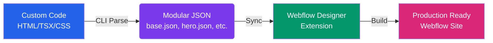

# ⚡ Code to Webflow


> **The ultimate bridge between hand-coded excellence and Webflow's visual power.**

Code to Webflow is a high-performance ecosystem designed to parse your custom HTML, React (TSX), and Tailwind CSS projects into modular, Webflow-ready structures. No more manual copying and pasting — just seamless synchronization.

---

## 🚀 The Workflow



---

## ✨ Key Features

### 🛠️ Advanced Parsing & Extraction
- **Multi-Format Support**: Directly parses `.html`, `.tsx` (React), and standalone `.css` files.
- **Smart Section Splitting**: Automatically detects and separates Navbars, Heroes, Sections, and Footers into modular components.
- **Component Detection**: Identifies repeatable structural patterns and marks them as components/variants for Webflow.

### 🎨 Design System Synchronization
- **Tailwind Variable Support**: Full resolution of Tailwind CSS variable chains (`--tw-*`) into static properties.
- **Variable Collections**: Automatically maps CSS variables to Webflow Variable Collections, preserving modes (Light/Dark).
- **Style Normalization**: Clean, Webflow-compatible property mapping that handles complex CSS shorthands and offsets.

### 🧩 Seamless Integration
- **Complex Selector Handling**: Automatically inlines descendant and parent-child selectors that Webflow doesn't natively support in the Style Panel.
- **Custom Code Embeds**: Extracts keyframes, unsupported media queries, and scripts into clean HTML Embeds.
- **Client-First Compatible**: Optimized for use with Finsweet’s Client-First methodology.

---

## 📦 Installation

### 1. Backend CLI
The CLI processes your local files into Webflow-readable data.

```bash
cd code-to-webflow-backend
npm install
npm run build
```

### 2. Frontend Extension
The extension lives inside Webflow to receive the data.

```bash
cd code-to-webflow-frontend
npm install
npm run dev
```

---

## 📖 Usage Guide

### Step 1: Generate the Data
Point the CLI to your project directory. It will scan for code and output a modular project folder.

```bash
# From the backend directory
npm start <path-to-your-project>
```

✨ **Output:** A folder in `/output` containing:
- `base.json`: Global variables and shared styles.
- `hero.json`, `nav.json`, etc.: Individual modular sections.
- `styles-embed.json`: Complex CSS and animations.

### Step 2: Sync to Webflow
1. Open your Webflow project.
2. Launch the **Code to Webflow Extension**.
3. Select and upload your generated JSON files.
4. Watch as the extension builds your site structure, styles, and variables in real-time.

---

## 🏗️ Architecture

- **`code-to-webflow-backend`**: A TypeScript CLI built with `Commander`, `PostCSS`, and `Parse5`. It performs structural fingerprinting to detect components and normalizes CSS for the Webflow API.
- **`code-to-webflow-frontend`**: A Webflow Designer Extension built with the `@webflow/webflow-cli`. It acts as the bridge, communicating directly with the Webflow Designer API to create elements and styles.

---

## 🤝 Contributing

Contributions are welcome! Whether it's reporting a bug, suggesting a feature, or submitting a pull request, we appreciate your help in making the code-to-visual bridge stronger.

---

## 📄 License

Distributed under the ISC License. See `LICENSE` for more information.

---

<p align="center">
  Built with ❤️ for the VibeCoding community.
</p>
