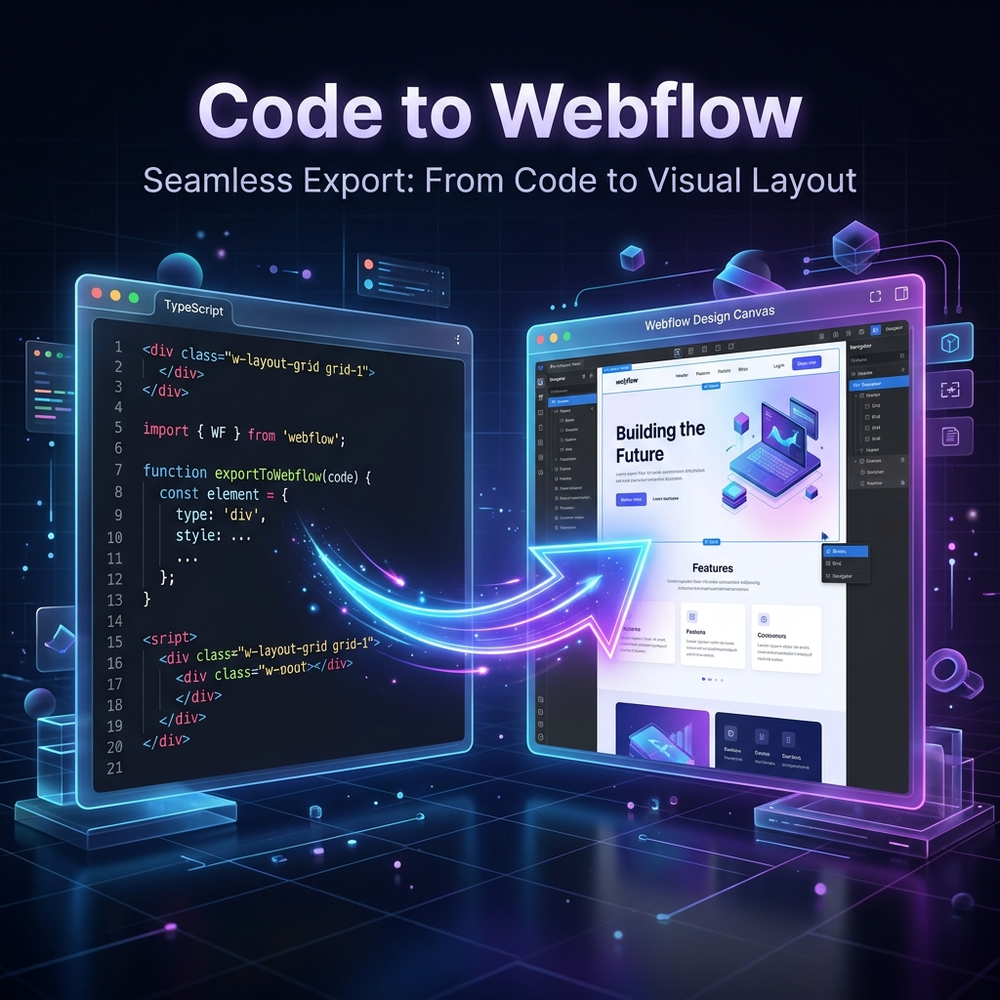
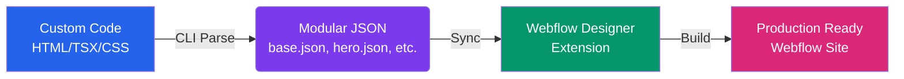
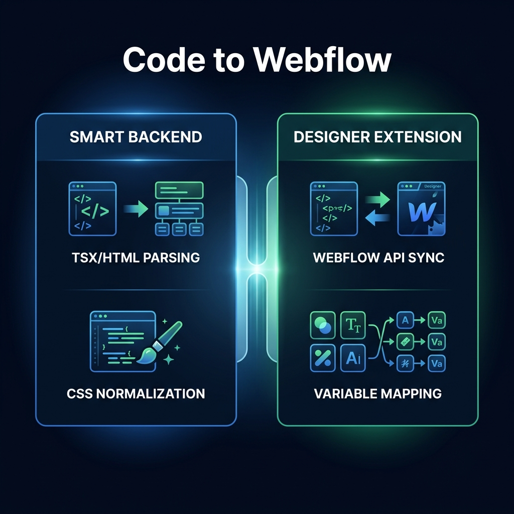

# ⚡ Code to Webflow



> **The ultimate bridge between hand-coded excellence and Webflow's visual power.**

Code to Webflow is a high-performance ecosystem designed to parse your custom HTML, React (TSX), and Tailwind CSS projects into modular, Webflow-ready structures. No more manual copying and pasting — just seamless synchronization.

---

## 🚀 The Workflow



---

## ✨ Key Features



### 🛠️ Smart Backend CLI
- **Advanced AST Parsing**: Directly parses `.html`, `.tsx` (React), and standalone `.css` files into structured element trees.
- **Structural Fingerprinting**: Automatically detects repeatable patterns to generate modular sections (Navbar, Hero, Footer, etc.).
- **CSS Normalization**: Resolves Tailwind CSS variable chains (`--tw-*`), expands CSS shorthands (padding, border, etc.), and handles complex media queries.
- **Client-First Optimized**: Structures all output following Finsweet’s Client-First methodology by default.

### 🎨 Intelligent Designer Extension
- **Webflow API Sync**: Real-time communication with the Webflow Designer API to build complex DOM trees instantly.
- **Native Variable Mapping**: Matches CSS variables to Webflow Variable Collections with folder-prefix support and fuzzy matching.
- **IPC Safety & Performance**: Built-in retry logic, chunked style application, and timeouts to prevent Designer API bridge hangs.
- **Complex Selector Inlining**: Handles descendant and parent-child selectors by automatically inlining them into matching Webflow elements.

---

## 📦 Tech Stack

- **Backend**: [TypeScript](https://www.typescriptlang.org/), [PostCSS](https://postcss.org/), [Commander](https://github.com/tj/commander.js), [Parse5](https://github.com/inikulin/parse5)
- **Frontend**: [Webflow Designer API](https://developers.webflow.com/), [TypeScript](https://www.typescriptlang.org/), [Webflow CLI](https://github.com/webflow/webflow-cli)
- **Styling**: [Tailwind CSS](https://tailwindcss.com/) support, [CSS Variables](https://developer.mozilla.org/en-US/docs/Web/CSS/Using_CSS_custom_properties) resolution

---

## 📖 Usage Guide

### Step 1: Install Dependencies
```bash
# Install CLI
cd code-to-webflow-backend && npm install && npm run build

# Install Extension
cd ../code-to-webflow-frontend && npm install
```

### Step 2: Generate Webflow JSON
Point the CLI to your project directory.
```bash
# From the backend directory
npm start <path-to-your-project>
```
✨ **Output:** A modular project folder in `/output` containing `base.json` and section-specific JSON files.

### Step 3: Sync to Webflow
1. Start the local extension server: `npm run dev` (inside frontend folder).
2. Open your Webflow project and launch the **Code to Webflow Extension**.
3. Upload your generated JSON files and watch the magic happen!

---

## 🤝 Contributing

Contributions are welcome! Whether it's reporting a bug, suggesting a feature, or submitting a pull request, we appreciate your help in making the code-to-visual bridge stronger.

---

## 📄 License

Distributed under the ISC License. See `LICENSE` for more information.

---

<p align="center">
  Built with ❤️ for the VibeCoding community.
</p>
